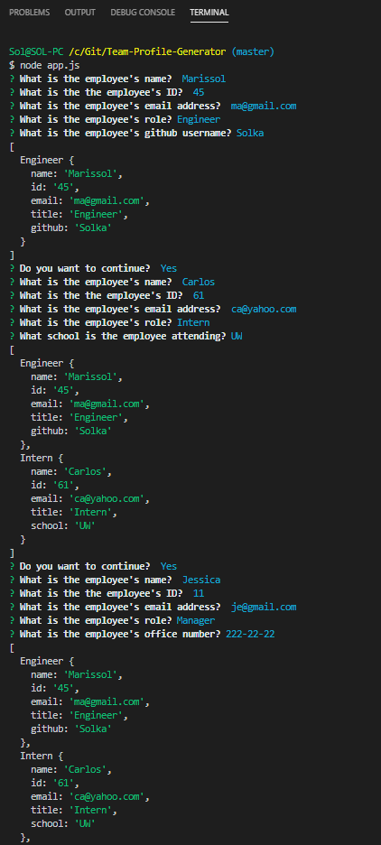

# TPG
Team Profile Generator - Homework 10

## Instructions
This is a software engineering team generator command line application. The user will be prompted for information about the employee and it will display this info in html in a card format. It can generate as many employees (cards) as needed and it may be a mix of manager, engineers, and interns. The prompt will be slightly different depending on each employee's role, which will be one of the choices that the user may answer.For instance, manager will be asked for an office number, while engineer will be asked for a GitHub page, and intern for the school that he/she is attending.

## User Story
As a manager
I want to generate a webpage that displays my team's basic info
so that I have quick access to emails and GitHub profiles

## Snapshots

## GitHub Page
https://solka2019.github.io/Team-Profile-Generator/.

